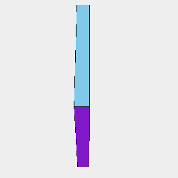

# shape.absolute()

Makes the local orientation of a shape match its absolute orientation.

This means that [flat](#https://raw.githubusercontent.com/jsxcad/JSxCAD/master/nb/api/flat.nb) will have no effect.

'''
Box(10)
  .e(1)
  .rx(1 / 8)
  .absolute()
  .flat()
  .view()
'''

```JavaScript
Box(10)
  .ez(1)
  .rx(1 / 8)
  .absolute()
  .flat()
  .view()
  .md('It is already disoriented.');
```



It is already disoriented.

Without absolute, the shape will be returned to its local orientation by [flat](#https://raw.githubusercontent.com/jsxcad/JSxCAD/master/nb/api/flat.nb).
'''
Box(10)
  .ez(1)
  .rx(1 / 8)
  .flat()
  .view()
'''

```JavaScript
Box(10)
  .e(1)
  .rx(1 / 8)
  .flat()
  .view()
  .md('It becomes disoriented.');
```


It becomes disoriented.
