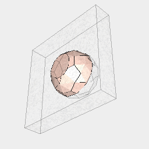

# shape.clip
#### (...other, ['exact', 'open', 'noVoid'])

Limits the coverage of shape that covered by all of the other shapes.

Flags:
* 'exact' uses slower but exact computations. Non-exact maintains a watertight manifold.
* 'open' produces a surface rather than a solid.
* 'noVoid' does not clip void geometry.

See: [clipFrom](#https://raw.githubusercontent.com/jsxcad/JSxCAD/master/nb/api/clipFrom.nb)

```JavaScript
Box(10)
  .color('blue')
  .clip(Arc(12).color('red'))
  .view()
  .md("Box(10).color('blue').clip(Arc(12).color('red'))");
```


Box(10).color('blue').clip(Arc(12).color('red'))

```JavaScript
Box(10)
  .ez(2)
  .material('copper')
  .clip(Orb(5))
  .view()
  .md("Box(10).ez(2).material('copper').clip(Orb(5))");
```



Box(10).ez(2).material('copper').clip(Orb(5))

```JavaScript
Box(10, 10, 10)
  .clip(Box(12, 12, 8), 'open')
  .view()
  .md("Box(10, 10, 10).clip(Box(12, 12, 8), 'open')");
```


Box(10, 10, 10).clip(Box(12, 12, 8), 'open')
