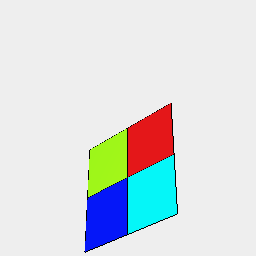
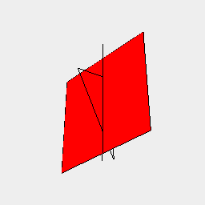
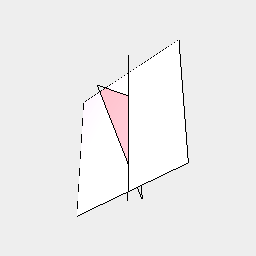

[index](../../nb/api/index.md)
# shape.color(name)

Sets the color of all leaf geometry in shape to the named color, replacing existing colors.

The names may be textual, e.g, 'red', or numeric, e.g., '#fafafe'.

See: [tint](../../nb/api/tint.md)

```JavaScript
Group(
  Box(3).color('red'),
  Box(3).color('chartreuse'),
  Box(3).color('#0000ff'),
  Box(3).color('cyan')
)
  .pack()
  .view()
  .md(
    "Group(Box(3).color('red'), Box(3).color('chartreuse'), Box(3).color('#0000ff'), Box(3).color('cyan')).pack()"
  );
```



Group(Box(3).color('red'), Box(3).color('chartreuse'), Box(3).color('#0000ff'), Box(3).color('cyan')).pack()

```JavaScript
Box(10)
  .color('red')
  .and(
    Arc(10)
      .rx(1 / 8)
      .color('chartreuse'),
    Triangle(10)
      .rx(3 / 16)
      .color('#0000ff')
  )
  .view(1)
  .md('These have various colors')
  .color('pink')
  .view(2)
  .md("Now color('pink') makes them are all pink.");
```



These have various colors



Now color('pink') makes them are all pink.
