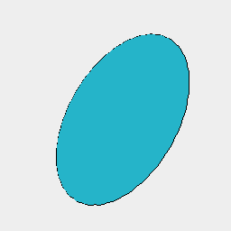

### f()

Converts the shape to segments and fills them to produce surfaces.

[fill](https://raw.githubusercontent.com/jsxcad/JSxCAD/master/nb/api/f.nb) is the long version of this operator.

This follows an odd-even winding rule, allowing holes to be constructed.

See: [fill](https://raw.githubusercontent.com/jsxcad/JSxCAD/master/nb/api/fill.nb).

```JavaScript
Loop(Point(0, 0, 0), Point(0, 1, 0), Point(1, 1, 0))
  .fill()
  .view()
  .note(
    'Loop(Point(0, 0, 0), Point(0, 1, 0), Point(1, 1, 0)).fill() produces a triangle.'
  );
```


Loop(Point(0, 0, 0), Point(0, 1, 0), Point(1, 1, 0)).fill() produces a triangle.

```JavaScript
Arc([4, 5], 2, 0)
  .rz(seq({ by: 1 / 32 }))
  .fill()
  .view()
  .note(
    'Arc([4, 5], 2, 0).rz(seq({ by: 1 / 32 })).fill() shows the odd-even rule.'
  );
```



Arc([4, 5], 2, 0).rz(seq({ by: 1 / 32 })).fill() shows the odd-even rule.
