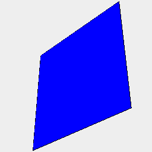

### in()
Produces the interior of an item.

This is necessary as most operations do not cross the item boundary, and consider the item as a leaf geometry.

```JavaScript
Box(5)
  .color('blue')
  .as('item')
  .view()
  .note(
    "Box(5).color('blue').as('item').tags('color') does not count the blue box."
  )
  .tags('color')
  .in()
  .note("in().tags('color') counts the blue box.")
  .tags('color');
```



Box(5).color('blue').as('item').tags('color') does not count the blue box.

tags:

in().tags('color') counts the blue box.

tags: blue
