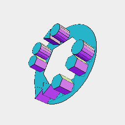
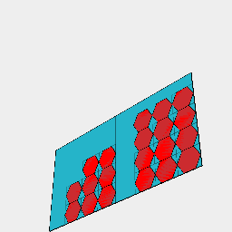

[index](../../nb/api/index.md)
### pack()
Parameter|Default|Type
---|---|---
{size}||Pair of numbers [width, height]
{pageMargin}|5|Number of mm to reserve around the edge of the page
{itemMargin}|1|Number of mm to reserve around each item on the page
{perLayout}|Infinity|Maximum number of shapes per page
packSize|[]|Array of [width, height] filled in with the width and height decided by pack

Packs a number of shapes into a page.

The page may have a provided size, otherwise it will be considered unlimited.

If packing exceeds the capacity of a page, it will spill over onto another page.

These pages may be packed as items, or downloaded as a series.

The packaged page is an item, accessing the content will require using in().

See: [in](../../nb/api/in.md)

```JavaScript
Seq({ upto: 10 }, Box, Group)
  .pack()
  .view()
  .note(
    'Seq({ upto: 10 }, Box, Group).pack() arranges 10 boxes of various sizes on an unlimited page.'
  );
```



Seq({ upto: 10 }, Box, Group).pack() arranges 10 boxes of various sizes on an unlimited page.

```JavaScript
Seq({ upto: 10 }, Box, Group)
  .pack({ size: [20, 20] })
  .each(and(bb(1, 1, 0).outline().color('red')).as('page'))
  .pack()
  .view()
  .note(
    "pack({ size: [20, 20] }).each(and(bb(1, 1, 0).outline().color('red')).as('page')) packs the boxes into 20x20 pages, adds a border and then packs those."
  );
```



pack({ size: [20, 20] }).each(and(bb(1, 1, 0).outline().color('red')).as('page')) packs the boxes into 20x20 pages, adds a border and then packs those.
