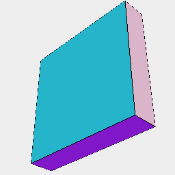
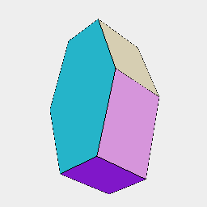
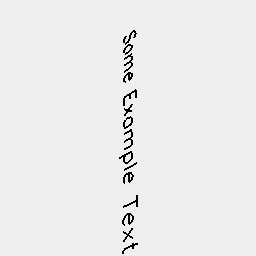
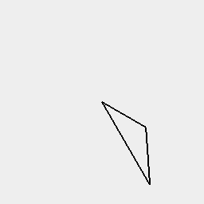
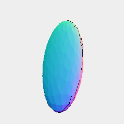
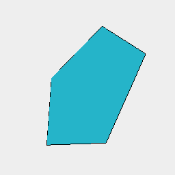
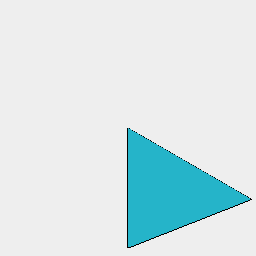

# Creating Geometry
One of the core functions of JSxCAD is creating geometry and a number of primitives and helper functions are provided to make creating new geometry easier. Generally geometry primitives are provided in the form thing(x axis diameter, y axis diameter, z axis height) where the second two are optional.

---
### Arc
Create a circle or a section of a an arc. The number of sides can be computed automatically to limit maximum deviation from the ideal circle using .hasZag(deviation).

```JavaScript
const aCircle = Arc(10).view();
```


```JavaScript
const anElipseExtruded = Arc(10, 5, 2).view();
```


```JavaScript
const aCircleWithSides = Arc(10).hasSides(8).view();
```


```JavaScript
const aCircleWithZag = Arc(20).hasZag(0.1).view();
```


---
### Box
Creates a 2D or 3D box

```JavaScript
Box(10, 10).view();
```


```JavaScript
Box(10, 10, 2).view();
```



---
### Curve
Create a bezier curve. The number of segments is scaled automatically to match the curvature.

```JavaScript
Curve(Point(0, 0), Point(10, 10), Point(20, 30), Point(40, 0)).view();
```


```JavaScript
Curve([0, 0], [10, 0], [10, 10], [20, 10])
  .rx(1 / 4)
  .edges(ArcX(0, 4, 4).hasSides(6), Loft)
  .view();
```


---
### Empty
Creates a new empty geometry

```JavaScript
Empty().view();
```

---
### Hexagon
Creates a new hexagon

```JavaScript
Hexagon(4).view();
```


```JavaScript
Hexagon(6, 3, 2).view();
```


---
### Hershy
A built in single line font useful for adding text

```JavaScript
Hershey('Some Example Text', 20).by(align('xy')).view();
```



---
### Icosahedron
Creates a new Icosahedron

```JavaScript
Icosahedron(10).view();
```



---
### Line
Creates a new line

```JavaScript
Line(10).view();
```


---
### Link
Links a set of ordered points together into ordered segments.

```JavaScript
Group(Point(0, 0), Point(10, 10), Point(20, 10)).link().view();
```


```JavaScript
Arc(10)
  .hasAngle(-1 / 3, 1 / 3)
  .x(-3, 3)
  .link()
  .view();
```


---
### Loop
Loop is very similar to link, except that the last point is connected back to the first point.

```JavaScript
Group(Point(0, 0), Point(10, 10), Point(20, 10)).loop().view();
```


---
### Octagon
Creates a new Octagon

```JavaScript
Octagon(20).view();
```



---
### Orb
Creates a new spheroid

```JavaScript
Orb(10).view();
```


```JavaScript
Orb(10, 5, 2).view();
```


---
### Pentagon
Generates a pentagon

```JavaScript
Pentagon(10).view();
```



---
### Point
A point in 3D space

```JavaScript
Point(0, 0, 0).view();
```



---
### Polygon
Creates a new polygon from the input points

```JavaScript
Polygon(Point(0, 0, 0), Point(10, 0, 0), Point(10, 10, 0)).view();
```


```JavaScript
Polygon([0, 0, 0], [10, 0, 0], [10, 10, 0]).view();
```



---
### Septagon
Creates a Septagon.

```JavaScript
Septagon(10).view();
```


---
### Triangle
Triangle creates a new triangle.

```JavaScript
Triangle(4, 9).view();
```


