---
# Interactions between geometry
JSxCAD offers a number of ways to interact two or more geometries to create new geometry. Most of these operations will work on both 2D and 3D geometry.

---
### ADD
Returns the shape extended to include the space of the added shapes.

```JavaScript
Arc(10, 10, 5)
  .color('blue')
  .add(Box(5, 5, 5).move(3, 0, 2).color('red'))
  .view()
  .note(`The result is blue since the blue shape was added to`);
```

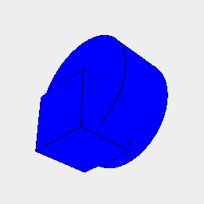

The result is blue since the blue shape was added to

---
### Assembly
Assembles together two or more 2D or 3D shapes to form a single one.

Shapes interact subtractively with shapes later in the arguments list meaning that no overlap is allowed in the generated assembly.

The assembled shapes can later be disassembled into their disjoint parts.

See Group as an alternative.

```JavaScript
const twoCylindersAssembled = Assembly(
  Arc(10, 10, 3).color('red'),
  Arc(10, 10, 3).color('blue').x(4)
).view();
```

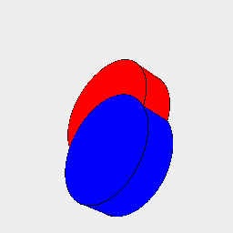

This can also be achieved with a.fit(b) and a.fitTo(b).

```JavaScript
Arc(10).fit(Box(5)).pack().view();
```

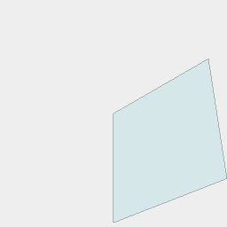

```JavaScript
Arc(10).fitTo(Box(5)).pack().view();
```

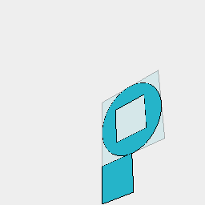

---
### ChainHull
Performs the hull operation sequentially on the input shapes.

```JavaScript
ChainHull(Arc(10), Box(5).move(12, 12, 0), Arc(20).x(40)).view();
```

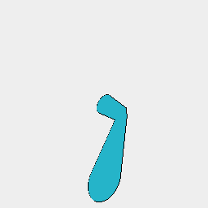

---
### Clip
Returns the shape limited to the space of the clipping shapes.

```JavaScript
Arc(10, 10, 5)
  .color('blue')
  .clip(Box(5, 5, 5).move(3, 0, 2).color('red'))
  .view()
  .md(`The result is blue since the blue shape was clipped`);
```


The result is blue since the blue shape was clipped

```JavaScript
Arc(10, 10, 5)
  .color('blue')
  .clipFrom(Box(5, 5, 5).move(3, 0, 2).color('red'))
  .view()
  .md(`The result is red since the red shape was clipped from.`);
```


The result is red since the red shape was clipped from.

---
### Cut
Returns the shape with space of the cut shapes removed.

```JavaScript
Arc(10, 10, 5)
  .color('blue')
  .cut(Box(5, 5, 5).move(3, 0, 2).color('red'))
  .view()
  .md(`The result is blue since the blue shape was cut.`);
```


The result is blue since the blue shape was cut.

```JavaScript
Arc(10, 10, 5)
  .cutFrom(Box(5, 5, 5).move(3, 0, 2))
  .view()
  .md(`The result is red since the red shape was cut from.`);
```


The result is red since the red shape was cut from.

---
### Fit
Fits two shapes together such that one cuts into the other. The result is similar to assembly.

```JavaScript
const axle = Arc(5, 5, 10).color('brown');
```

```JavaScript
const wheel = Arc(20, 20, 2).color('grey');
```

```JavaScript
wheel.fitTo(axle).view();
```


```JavaScript
axle.fit(wheel).view();
```

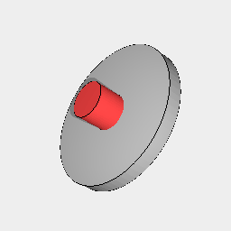

```JavaScript
wheel.fitTo(axle).pack().view(); //In both of these cases the axle cuts the wheel.
```

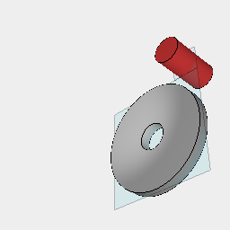

---
### Group
Similar to Assembly, group joins together a number of shapes, however unlike Assembly, Group does not subtract the shapes which means they are allowed to overlap which makes Group much faster to compute than Assembly.

Group can also be done using the .and() operator.

```JavaScript
Group(Arc(10, 10, 3), Arc(10, 10, 3).x(4)).view();
```

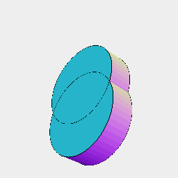

```JavaScript
Arc(10, 10, 3).and(Arc(10, 10, 3).x(4)).view(); //Does a group
```


---
### Hull
Performs the hull operation on the input shapes.

```JavaScript
Hull(Arc(10), Box(5).move(12, 12, 0), Arc(20).x(40)).view();
```

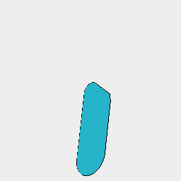

---
### Mask
Mask is used to create a mask around something. This allows the shape to cut a larger hole than it's actual size to add play or for example around the threads of a bolt.

```JavaScript
const shaft = Arc(10, 10, 40).color('grey');
```

```JavaScript
shaft.mask(grow(1)).view();
```

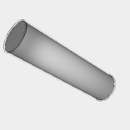

---
### Pack
Pack takes input geometry and lays it out on a sheet. Groups and Assemblies are split apart, but items are preserved.

```JavaScript
Group(Arc(10), Box(3), Box(3.5)).pack().view();
```

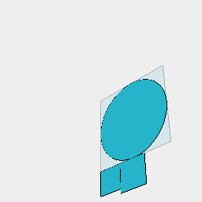

```JavaScript
Group(Arc(10), Box(3), Box(3.5)).as('anItem').pack().view();
```

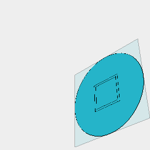
