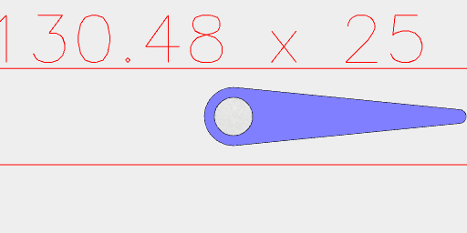
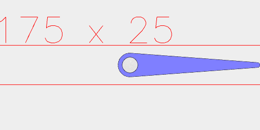
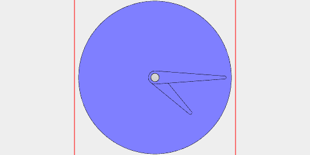

import { Text, readFont } from '@jsxcad/api-v1-font';

const faceRadius = control('face radius', 90, 'input');

const axleRadius = control('axle radius', 5, 'input');

const faceThickness = control('face thickness', 3, 'input');

const fontSize = control('font size', 20, 'input');

const hourHand = { reach: 0.65, tipRadius: 1.75, thickness: 3 };

const minuteHand = { reach: 0.9, tipRadius: 1.5, thickness: 3 };

const clock = { hourHand, minuteHand };

const Hand = ({ reach, tipRadius, thickness }) =>
  Hull(
    Arc().hasRadius(axleRadius + 2.5),
    Arc()
      .hasRadius(tipRadius)
      .move(reach * faceRadius)
  ).cut(Arc().hasRadius(axleRadius));

const Face = ({ axleRadius, faceRadius, fontSize }) =>
  Arc()
    .hasRadius(faceRadius)
    .cut(Arc().hasRadius(axleRadius))
    .and(
      ...seq(
        (n) =>
          Text(aladinRegular, `${n}`, 20)
            .align('xy')
            .y(faceRadius - fontSize)
            .rz(-n / 12),
        { from: 1, to: 12 }
      )
    );

const Clock = ({ hourHand, minuteHand }) =>
  Group(
    Face({ axleRadius, faceRadius, faceThickness, fontSize }),
    Hand(hourHand)
      .rz(45 / 360)
      .z(faceThickness),
    Hand(minuteHand).z(faceThickness + hourHand.thickness)
  );

### (Needs redesign)

# Clock

This is a simple project to produce a clock.

## Clock Display

We want to produce a display something like this.

## Parameters

## Parts

const aladinRegular = await readFont(
  'https://gitcdn.link/repo/google/fonts/master/ofl/aladin/Aladin-Regular.ttf'
);

Face({ axleRadius, faceRadius, fontSize }).md('The clock face').gridView();

The clock face

Hand(hourHand).topView();

The hour hand.

Hand(minuteHand).topView();

The minute hand.

## Assembly

Clock(clock).topView();

A complete clock.
